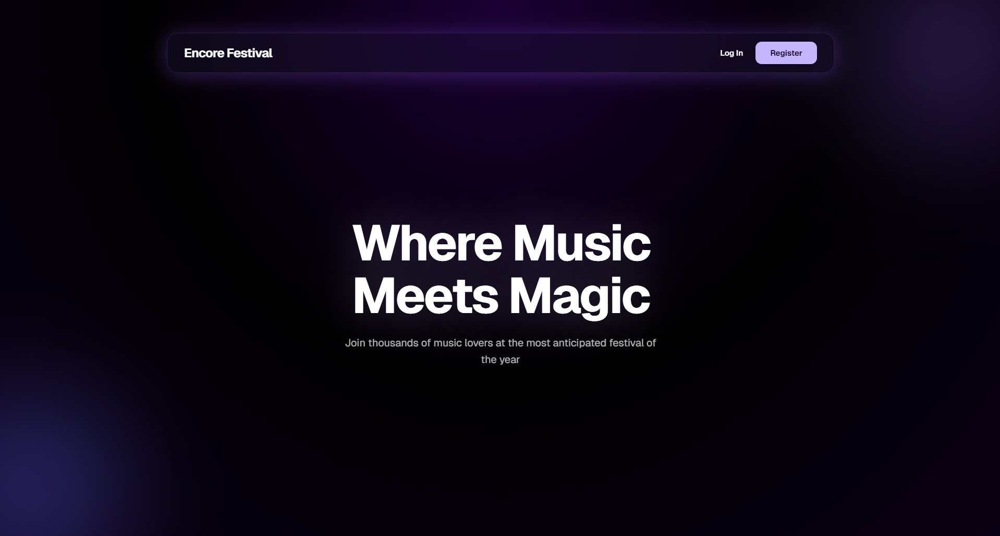
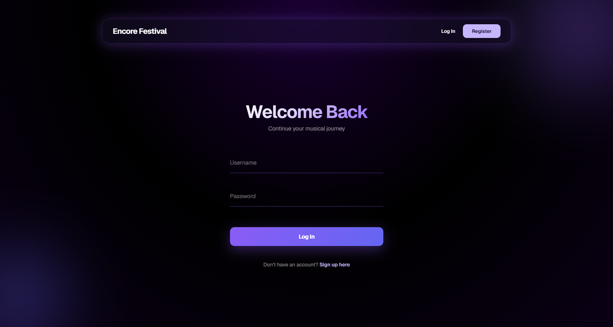
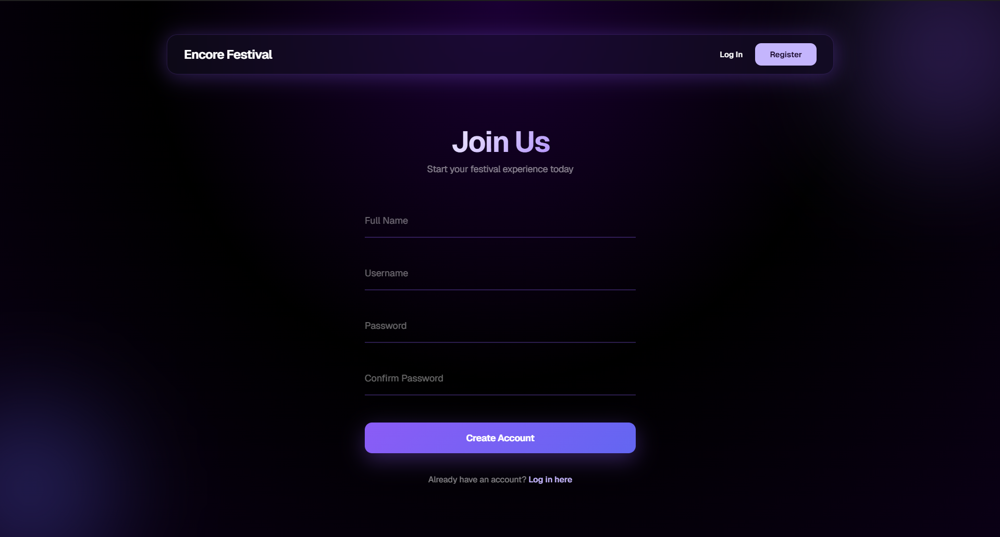
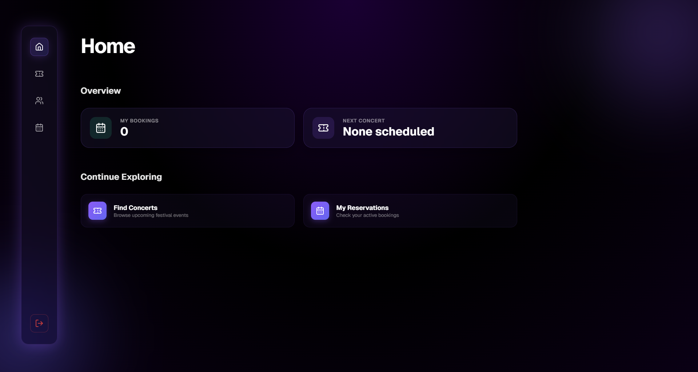
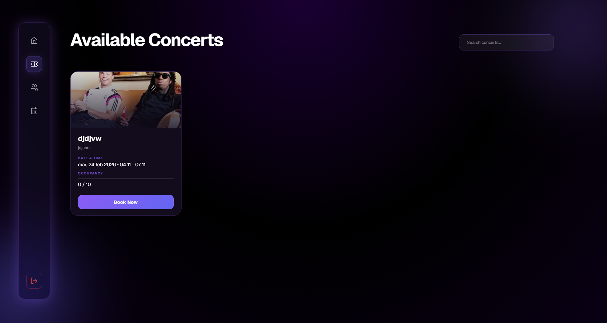
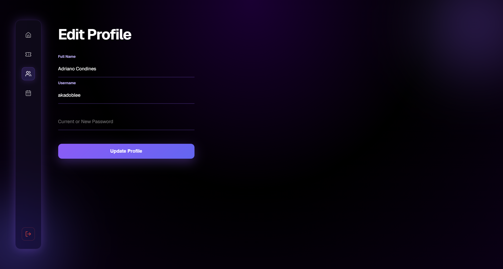
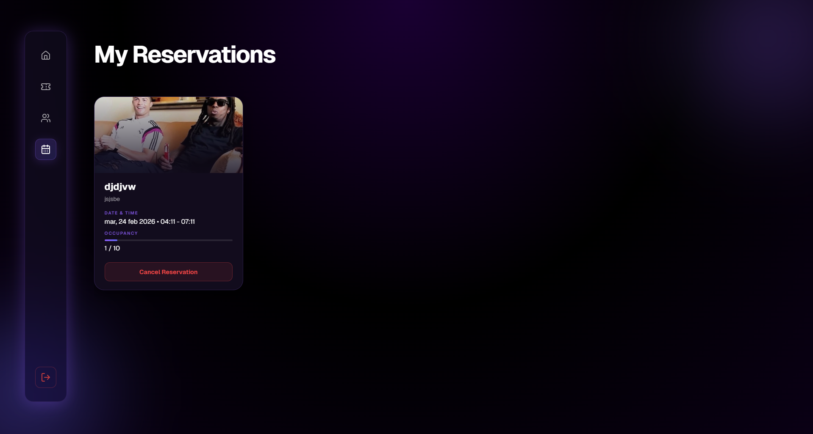
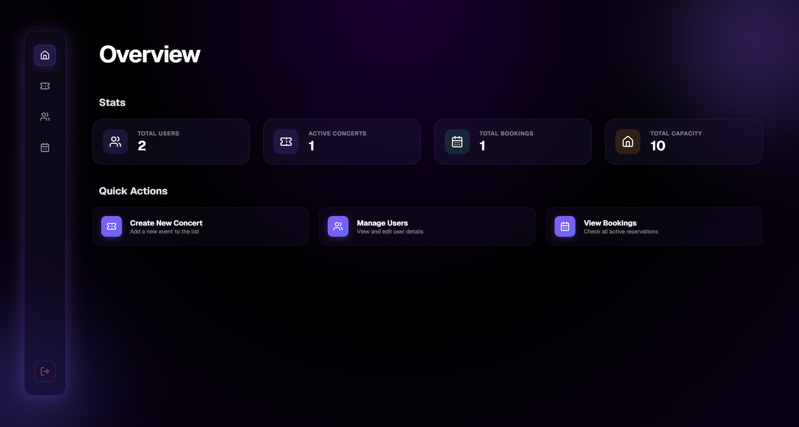
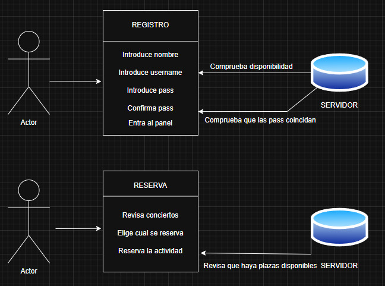

# ENCORE FESTIVAL - ESCRITORIO

Esta es la versión de escritorio de la aplicación del festival Encore. Esta aplicación permite a los usuarios ver los horarios de los conciertos y reservar entradas para los mismos.

## Tecnologías Utilizadas

Para este proyecto se han utilizado las siguientes tecnologías para crear una aplicación que cumpla con los requisitos impuestos:

- **Electron**: Framework para crear aplicaciones de escritorio utilizando Chromium y Node.js para funcionar.
- **Vue**: Framework para crear la UI.
- **MongoDB**: Base de datos no relacional para guardar los datos.
- **Node.js**: Entorno de ejecución.
- **npm**: Gestor de paquetes.

## Características

- Registro e inicio de sesión de usuarios.
- Reserva y cancelación de entradas para conciertos (sin reservas duplicadas).
- Panel de administración para gestionar conciertos, usuarios y reservas.

## Instalación del proyecto

Para instalar el proyecto se deben seguir los siguientes pasos:

1. Clonar el repositorio.
2. Ejecutar el comando `npm install` para instalar las dependencias.
3. Ejecutar el comando `npm run build` para compilar e iniciar el proyecto.

## Vistas de la Aplicación

### Vista de Inicio

### Vista de Inicio de Sesión

### Vista de Registro

### Vista Home

### Vista de Conciertos Disponibles

### Vista de Edición de Perfil

### Vista de Mis Reservas

### Vista del Panel de Administrador

## Diagramas de casos de uso
En este caso están representados los diagramas de casos de uso del registro de un usuario y de la reserva para un concierto.

